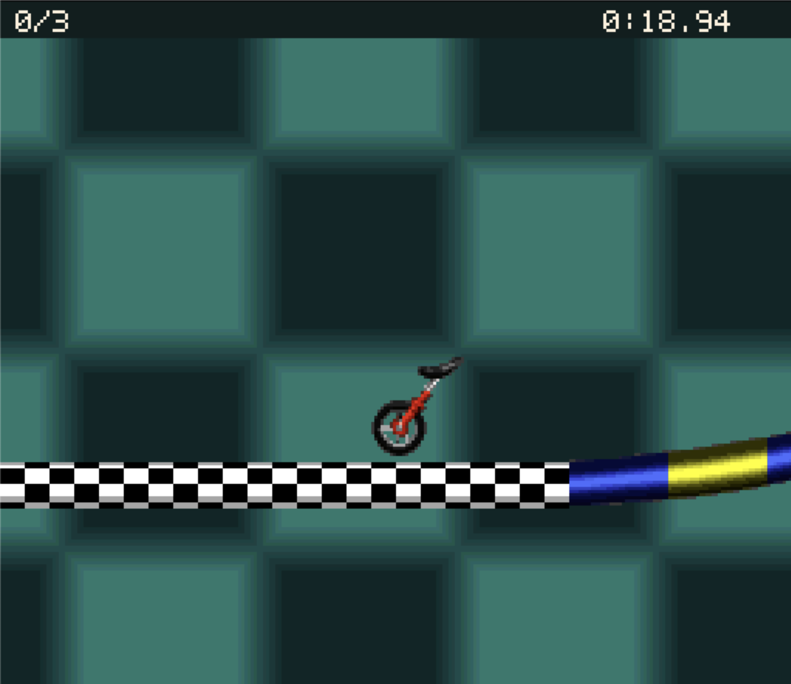

# Unirally Reconstruction

Reconstructing Unirally in readable C++ - toward a faithful, portable native version.

An in-progress reconstruction of the PAL version of
[Unirally (Uniracers)](https://en.wikipedia.org/wiki/Uniracers). The project studies
original behavior, implements it in native code, and compares the results against
reproducible reference experiments. Readable source and preserving the original
integer arithmetic and timing are central goals.

Development is also an experiment in agent-driven engineering: agents recover
behavior, implement it, and independently review changes, with the evidence and
handoffs kept in this repository.



*Gameplay screenshot supplied by the maintainer. See below for the project's accepted capabilities and current limitations.*

## What works today

- **DRAGSTER:** the accepted one-player CRAWLER/DRAGSTER path runs from race
  start through winner or loser results in the native desktop app.
- **Desktop controls and display:** keyboard and gamepad input, integer-scaled
  presentation, and a 50 Hz PAL game update loop using SDL3.
- **ZOOM ZOO:** playable in the native desktop app from native race
  initialization through countdown, three laps, result and Race Again, with the
  original's rider art, HUD values and start-line animation (M4-16; see project
  state for its acceptance record and declared omissions).

This is a prototype with limited game coverage. Audio, complete DRAGSTER rider
artwork, other playable tracks and modes, menus and progression, multiplayer, and public
release packages are not yet supported. Native play uses extracted content and
does not execute the original CPU.

See [project state](docs/STATE.md) for the exact accepted boundaries and
[current work](tasks/NEXT_SESSION.md) for the latest development handoff.

## Build and test

The project uses C++20, CMake, Python, and checksum-pinned SDL3 dependencies.
macOS and Linux have automated synthetic build and test coverage; those checks
do not establish full gameplay accuracy on either platform.

Run the baseline checks without a ROM from the repository root:

```sh
python3 tools/project.py doctor
python3 tools/project.py bootstrap
python3 tools/project.py build --preset app-debug
python3 tools/project.py test --suite synthetic --preset app-debug
```

See [build and validation](docs/BUILD_AND_VALIDATION.md) for prerequisites,
implemented commands, and the distinction between synthetic and original-game
checks. See the [desktop app guide](src/app/README.md) for launch instructions.

Playing the supported Classic content requires a user-supplied ROM matching the
supported PAL revision. Extraction validates its identity and creates a local
content pack; later launches can use that pack without the ROM present.
**ROMs, extracted game assets, and save states are not included in this repository.**

## Where this is heading

The long-term ambition is an editable, portable Unirally with online multiplayer,
custom tracks, a track editor, and high-resolution replacement assets. These are
future goals, not current features. The [project plan](docs/PROJECT_PLAN.md)
describes the milestones and acceptance criteria.

## License

Project-owned code and documentation are available under the [MIT License](LICENSE).
This grant covers only rights held by the project authors. It does not grant
rights to the original Unirally/Uniracers game, ROMs, extracted game content,
trademarks, or original game artwork shown in screenshots. Third-party code and
dependencies retain their respective licenses and notices.

The project is not affiliated with or endorsed by the original game's rights
holders. Licensing the project does not change the
[contribution policy](CONTRIBUTING.md).

## Contributions

This repository is public so people can follow development and explore the
research. **External contributions and pull requests are not being accepted at
this stage.** See [the contribution policy](CONTRIBUTING.md).

## Development and research

| Guide | What you will find |
| --- | --- |
| [Project state](docs/STATE.md) | Accepted capabilities and current limitations |
| [Next session](tasks/NEXT_SESSION.md) | Current checkout, remaining work, and resume instructions |
| [Build and validation](docs/BUILD_AND_VALIDATION.md) | Tooling, checks, and acceptance evidence |
| [Native source guide](src/core/README.md) | A map of the reconstructed code |
| [Agent instructions](AGENTS.md) | Required entry point and project rules |
| [Agent workflow](docs/AGENT_WORKFLOW.md) | Ownership, independent review, and integration |
| [Task records](tasks/README.md) | Work history, dependencies, and evidence links |
| [Project plan](docs/PROJECT_PLAN.md) | Architecture, scope, and future milestones |

For research entry points, see [the second-track investigation](tasks/M4-02.md)
and [the content/read contract](tasks/M4-03.md). The
[reassessment handover](docs/REASSESSMENT_HANDOVER.md) preserves the historical
stopping boundary after that initial investigation.

New records use the [task](tasks/TEMPLATE.md),
[evidence](docs/templates/EVIDENCE.md), and
[decision](docs/templates/DECISION.md) templates. Source readability is defined
in [D-0003](docs/decisions/D-0003-human-readable-native-code.md); model and usage
policy in [D-0004](docs/decisions/D-0004-model-and-usage-budget.md); and capability
work and staged validation in
[D-0006](docs/decisions/D-0006-capability-driven-work.md).
